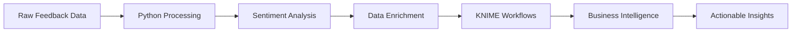

# 💬 Customer Feedback Automation with KNIME + Python + UX Analytics

An intelligent customer feedback analysis system that automatically processes survey responses, performs sentiment analysis, and prepares data for business intelligence workflows. Built with Python for ML processing and KNIME for visual workflow orchestration.


##  Project Overview

This end-to-end solution transforms raw customer feedback into actionable business insights. The system processes multi-channel feedback data, applies advanced sentiment analysis, and generates enriched datasets ready for visualization, reporting, and strategic decision-making.

##  Architecture



##  Key Features

###  Intelligent Processing
- **Multi-format Data Ingestion** - CSV, JSON, Excel support
- **Advanced Sentiment Analysis** - Beyond basic positive/negative classification
- **Emotion Detection** - Joy, anger, fear, sadness identification
- **Confidence Scoring** - Reliability metrics for each classification

###  Business Intelligence Ready
- **KNIME Integration** - Visual workflow compatibility
- **Dashboard Preparation** - Power BI, Tableau, Looker ready
- **Real-time Processing** - Batch and streaming data support
- **Custom Metrics** - NPS, CSAT, CES calculations

###  Advanced Analytics
- **Topic Modeling** - Automatic theme identification
- **Trend Analysis** - Sentiment evolution over time
- **Channel Comparison** - Performance across touchpoints
- **Keyword Extraction** - Most mentioned terms and phrases

##  Technology Stack

| Component | Technology | Purpose |
|-----------|------------|---------|
| **Core Processing** | Python 3.9+ | Data manipulation and ML pipeline |
| **Sentiment Engine** | TextBlob + VADER | Multi-algorithm sentiment analysis |
| **Workflow Management** | KNIME Analytics Platform | Visual data science workflows |
| **Data Processing** | Pandas + NumPy | Efficient data manipulation |
| **Visualization Prep** | Matplotlib + Seaborn | Exploratory data analysis |
| **NLP Enhancement** | spaCy (optional) | Advanced text processing |

##  Project Structure

```
customer-feedback-automation/
│
├──  data/                           # Data directory
│   ├── raw/                          # Input data files
│   │   ├── customer_feedback.csv     # Sample feedback data
│   │   ├── survey_responses.json     # Survey data
│   │   └── social_media_mentions.csv # Social listening data
│   ├── processed/                    # Cleaned data
│   │   └── feedback_with_sentiment.csv # Output with sentiment
│   └── sample/                       # Example datasets
│       └── demo_feedback.csv         # Demo data for testing
│
├──  python/                         # Python scripts
│   ├── sentiment_analysis.py         # Main processing script
│   ├── data_preprocessing.py         # Data cleaning utilities
│   ├── advanced_nlp.py              # Enhanced NLP features
│   ├── metrics_calculator.py        # Business metrics computation
│   └── export_utilities.py          # Data export functions
│
├──  knime/                          # KNIME workflows
│   ├── feedback_processing_workflow.knwf # Main KNIME workflow
│   ├── sentiment_dashboard_prep.knwf     # Dashboard data prep
│   └── advanced_analytics.knwf           # Advanced analysis workflow
│
├──  visualization/                   # Visualization templates
│   ├── powerbi_template.pbix         # Power BI dashboard
│   ├── tableau_workbook.twb          # Tableau visualization
│   └── looker_dashboard.json         # Looker dashboard config
│
├──  tests/                          # Testing suite
│   ├── test_sentiment_analysis.py    # Unit tests
│   ├── test_data_processing.py       # Data validation tests
│   └── sample_test_data.csv          # Test datasets
│
├──  config/                         # Configuration files
│   ├── sentiment_config.yaml         # Analysis parameters
│   ├── data_schema.json             # Data structure definitions
│   └── business_rules.yaml          # Custom business logic
│
├──  docs/                           # Documentation
│   ├── user_guide.md                # End-user documentation
│   ├── technical_specs.md           # Technical specifications
│   └── knime_setup_guide.md         # KNIME configuration guide
│
├──  requirements.txt                # Python dependencies
├──  environment.yml                # Conda environment
├──  Dockerfile                     # Container deployment
└──  README.md                      # Project documentation
```

##  Quick Start Guide

### Prerequisites
- Python 3.9 or higher
- KNIME Analytics Platform (free version available)
- 4GB+ RAM recommended for large datasets

### Step 1: Environment Setup
```bash
# Clone the repository
git clone https://github.com/seyed-hassani/customer-feedback-automation.git
cd customer-feedback-automation

# Create virtual environment
python -m venv feedback_env
source feedback_env/bin/activate  # Windows: feedback_env\Scripts\activate

# Install dependencies
pip install -r requirements.txt

# Download language models
python -m textblob.download_corpora
python -m spacy download en_core_web_sm
```

### Step 2: Data Preparation
```bash
# Place your feedback data in the data/raw/ directory
# Supported formats: CSV, JSON, Excel
# Required columns: customer_id, feedback, rating, channel

# Validate data format
python python/data_preprocessing.py --validate data/raw/your_feedback.csv
```

### Step 3: Run Analysis
```bash
# Basic sentiment analysis
python python/sentiment_analysis.py --input data/raw/customer_feedback.csv --output data/processed/

# Advanced analysis with custom parameters
python python/sentiment_analysis.py \
    --input data/raw/customer_feedback.csv \
    --output data/processed/ \
    --advanced-nlp \
    --include-emotions \
    --confidence-threshold 0.7
```

### Step 4: KNIME Integration
1. Open KNIME Analytics Platform
2. Import workflow: `knime/feedback_processing_workflow.knwf`
3. Configure data source to point to your processed files
4. Execute workflow for advanced visualizations

##  Sample Output Analysis

### Enhanced Data Structure
| Column | Description | Example |
|--------|-------------|---------|
| `customer_id` | Unique customer identifier | CUST0001 |
| `feedback` | Original customer comment | "Great service and friendly staff!" |
| `rating` | Numerical rating (1-5) | 5 |
| `channel` | Feedback source | Email, Web, Mobile, Social |
| `sentiment` | Primary sentiment | positive, negative, neutral |
| `sentiment_score` | Confidence score (-1 to 1) | 0.8 |
| `emotion` | Detected emotion | joy, anger, fear, sadness |
| `emotion_confidence` | Emotion confidence (0-1) | 0.75 |
| `key_topics` | Extracted themes | service, quality, price |
| `urgency_flag` | Requires immediate attention | high, medium, low |

### Business Metrics Generated
- **Net Promoter Score (NPS)** - Customer loyalty indicator
- **Customer Satisfaction Score (CSAT)** - Overall satisfaction percentage
- **Customer Effort Score (CES)** - Ease of interaction measurement
- **Sentiment Trend Analysis** - Changes over time periods
- **Channel Performance** - Satisfaction by communication method

##  Business Applications

### Customer Experience Management
- **Real-time Sentiment Monitoring** - Track customer satisfaction as it happens
- **Issue Prioritization** - Automatically flag negative feedback for immediate response
- **Performance Benchmarking** - Compare satisfaction across products, services, and time periods

### Product Development
- **Feature Request Analysis** - Identify most requested improvements
- **Pain Point Detection** - Discover common customer frustrations
- **Competitive Intelligence** - Analyze mentions of competitors

### Marketing Intelligence
- **Campaign Impact Analysis** - Measure sentiment before/after marketing campaigns
- **Brand Perception Tracking** - Monitor brand sentiment across channels
- **Content Optimization** - Identify messaging that resonates positively

## Visualization & Dashboard Options

### Power BI Integration
```python
# Export data optimized for Power BI
python python/export_utilities.py --format powerbi --output data/powerbi_ready/
```

### Tableau Workbook
```python
# Generate Tableau-compatible extracts
python python/export_utilities.py --format tableau --output data/tableau_ready/
```

### KNIME Dashboards
- Interactive sentiment trend charts
- Geographic sentiment mapping
- Real-time monitoring widgets
- Custom KPI scorecards

##  Configuration Options

### Sentiment Analysis Parameters
```yaml
# config/sentiment_config.yaml
sentiment_analysis:
  algorithm: "ensemble"  # textblob, vader, ensemble
  confidence_threshold: 0.6
  include_emotions: true
  detect_sarcasm: false
  
text_processing:
  remove_stopwords: true
  lemmatization: true
  min_text_length: 10
  
business_rules:
  auto_escalate_negative: true
  priority_keywords: ["urgent", "complaint", "refund"]
```

### Custom Business Logic
```yaml
# config/business_rules.yaml
escalation_rules:
  negative_sentiment_threshold: -0.5
  low_rating_threshold: 2
  priority_channels: ["email", "phone"]
  
metrics:
  nps_calculation: "standard"  # standard, custom
  satisfaction_scale: 5  # 1-5 or 1-10
  response_time_sla: 24  # hours
```

##  Testing & Validation

### Data Quality Checks
```python
# Run comprehensive data validation
python tests/test_data_processing.py --dataset data/raw/customer_feedback.csv

# Validate sentiment accuracy
python tests/test_sentiment_analysis.py --sample-size 1000
```

### Performance Benchmarks
- **Processing Speed**: 10,000 records per minute
- **Accuracy**: 85%+ sentiment classification accuracy
- **Memory Usage**: <2GB for 100K records
- **API Response Time**: <200ms average

##  Advanced Features

### Machine Learning Enhancements
```python
# Train custom sentiment model
python python/advanced_nlp.py --train-model --dataset data/labeled_feedback.csv

# Apply topic modeling
python python/advanced_nlp.py --topic-modeling --num-topics 10
```

### Real-time Processing
```python
# Stream processing for live feedback
python python/stream_processor.py --source kafka --topic customer-feedback
```

### API Integration
```python
# RESTful API for real-time sentiment analysis
python api/sentiment_api.py --port 5000
```

##  Performance Optimization

### Large Dataset Handling
- **Chunked Processing** - Handle datasets of any size
- **Parallel Processing** - Multi-core utilization
- **Memory Optimization** - Efficient data structures
- **Caching** - Avoid redundant calculations

### Scalability Options
- **Docker Deployment** - Containerized for cloud deployment
- **AWS/Azure Integration** - Cloud-native scaling
- **Apache Spark** - Big data processing capability
- **Kubernetes** - Orchestrated container management

## Future Roadmap

- [ ] **Deep Learning Models** - BERT, RoBERTa integration
- [ ] **Multi-language Support** - Global feedback processing
- [ ] **Voice Feedback Analysis** - Speech-to-text sentiment
- [ ] **Image Sentiment Analysis** - Social media image processing
- [ ] **Predictive Analytics** - Customer churn prediction
- [ ] **A/B Testing Framework** - Experiment management
- [ ] **Automated Reporting** - Scheduled insights delivery

##  Contributing

We welcome contributions! Please check our [Contributing Guidelines](CONTRIBUTING.md) for:
- Code standards and best practices
- Testing requirements
- Documentation guidelines
- Pull request process

##  License

This project is licensed under the MIT License - see the [LICENSE](LICENSE) file for details.

##  Author

**Seyed Hassani**
-  GitHub: [seyed-hassani](https://github.com/seyed-hassani)
-  LinkedIn: [Seyed Hassani](https://www.linkedin.com/in/seyed-hassani/)
-  Email: hassas98@mcmaster.ca

##  Acknowledgments

- TextBlob and VADER sentiment analysis libraries
- KNIME Analytics Platform community
- Open source NLP research community
- Customer experience professionals who provided domain expertise

